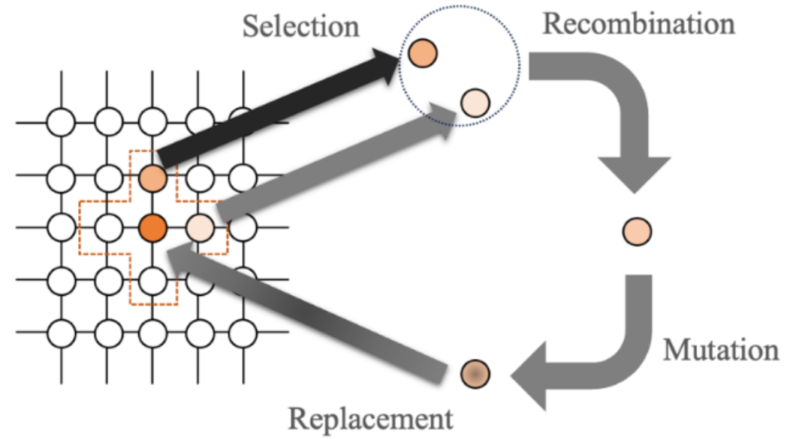

Neighborhood Operators
=======================

This module provides various neighborhood structures for cellular genetic algorithms (CGAs). Neighborhood structures define how individuals interact with others in their immediate vicinity, playing a critical role in regulating the flow of information and maintaining diversity within the population.

In cellular genetic algorithms, the concept of neighborhoods is integral to the evolutionary process. As shown in the diagram below, each individual in the population interacts with its neighbors during key stages of the evolutionary cycle: Selection, Recombination, Mutation, and Replacement. This localized interaction helps balance exploration and exploitation, promoting better local optimization while preserving diversity.

Figure 1: A representation of the reproduction cycle with neighborhood structure in a cellular genetic algorithm.

The neighborhood structure governs which individuals are selected for interactions during the evolutionary cycle. Depending on the problem requirements, users can choose different types of neighborhoods, such as linear or compact structures, to optimize the algorithm's performance.

**The Concept of Neighborhood**
-------------------------------

Neighborhood refers to a spatial structure used to improve solutions in optimization problems. In most cases, the neighborhood of a solution represents solutions obtained through small modifications.

Below are some popular neighborhood structures:

- **Linear Neighborhood**: Individuals interact with neighbors arranged in a straight line.
- **Compact Neighborhood**: A structure formed by cells surrounding an individual, allowing denser interaction.

**Why Use Different Structures?**

Each neighborhood structure is suited for specific problem types:
- **Linear structures** are more appropriate for sequential or ordered problems.
- **Compact structures** are ideal for scenarios requiring dense information sharing and local exploration.

**Neighborhood Scheme Examples**
------------------------

**Linear Neighborhood**  
A linear neighborhood structure refers to an arrangement where individuals interact with a specific number of neighbors in a straight line. For instance, consider a linear structure with 5 neighbors:

.. image:: images/linear_5_example.png
   :scale: 40%
   :alt: Linear 5 Neighborhood Structure
   :align: center

Figure 2: Linear 5 Neighborhood Structure

Each individual shares information only with its immediate neighbors. This structure is suitable for cases requiring limited information flow.

**Compact Neighborhood**  
Compact structures involve individuals sharing information intensively with all their surrounding neighbors. Below is an example of a compact structure with 9 neighbors:

.. image:: images/compact_9_example.png
   :scale: 40%
   :alt: Compact 9 Neighborhood Structure
   :align: center

Figure 3: Compact 9 Neighborhood Structure

This structure can achieve faster convergence but must be used cautiously to maintain diversity.

**API References**
------------------

The following sections provide detailed documentation for the neighborhood operators available in the `pycellga.neighborhoods` package.

**Linear 5**
^^^^^^^^^^^^

Description: A structure with 5 neighbors in a linear arrangement.

.. automodule:: pycellga.neighborhoods.linear_5
   :members:
   :undoc-members:
   :show-inheritance:

**Linear 9**
^^^^^^^^^^^^

Description: A linear arrangement with 9 neighbors for greater information flow.

.. automodule:: pycellga.neighborhoods.linear_9
   :members:
   :undoc-members:
   :show-inheritance:

**Compact 9**
^^^^^^^^^^^^^

Description: A compact structure with 9 neighbors for dense interaction.

.. automodule:: pycellga.neighborhoods.compact_9
   :members:
   :undoc-members:
   :show-inheritance:

**Compact 13**
^^^^^^^^^^^^^^

Description: A compact structure with 13 neighbors.

.. automodule:: pycellga.neighborhoods.compact_13
   :members:
   :undoc-members:
   :show-inheritance:

**Compact 21**
^^^^^^^^^^^^^^

Description: A compact structure with 21 neighbors for broader information sharing.

.. automodule:: pycellga.neighborhoods.compact_21
   :members:
   :undoc-members:
   :show-inheritance:

**Compact 25**
^^^^^^^^^^^^^^

Description: An extended compact structure with 25 neighbors for enhanced information sharing.

.. automodule:: pycellga.neighborhoods.compact_25
   :members:
   :undoc-members:
   :show-inheritance:
